# Enterprise Network Project - Security

## Project Overview 
A secure multi-site network infrastructure built using two FortiGate firewalls, site-to-site VPN connections, Client-Based VPN connection, and an AWS Cloud Tunnel integration. This setup forwards all network, server, and VPN logs into a centralized Splunk SIEM platform, providing full visibility and successful detection of active cyber attacks simulated through a Kali Linux attacker VM.

---

## Diagram

---

## Addressing Scheme

---

## Site-to-site VPN Implementation

Site 1 to Site 2:

Site1 tunnel up:

#

Site 2 to Site 1:

Site2 tunnel up:

---

## Client-Based VPN for remote access

User credentials created for ClientVPN Connection:

Correct connection properties displayed:

#
Remote access VPN type in use is L2TP with IPSec due to its enhanced security. L2TP creates a secure tunnel for data transfer, while IPSec encrypts the data within that tunnel, ensuring that the data remains confidential and protected from unauthorized access:

Client VPN connection active

---

## Apache Web Server and SSH Server set up for remote accessible connections

---

## Connectivity through VPN tunnel to servers from remote user established

Ping test:

#

Apache Web Server connection test:

#

SSH Server connection test:

---

### Logging and Splunk setup to collect logs from required core devices

FortiGate1:

#

FortiGate2:

#

Apache Web Server:

#

SSH Server:

#

Splunk Server UDP listening ports setup:

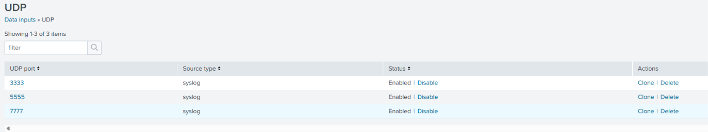

---

### Attack Simulation

Before simulating the attacks, a DOS policy is configured to block unwanted anomalies:

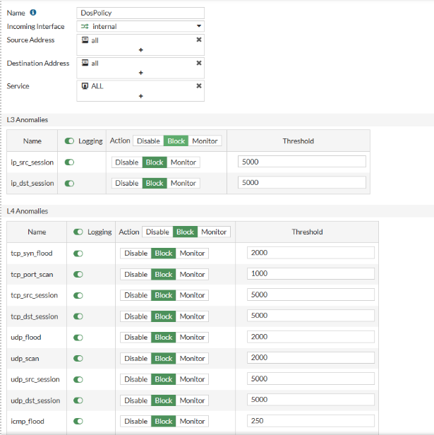
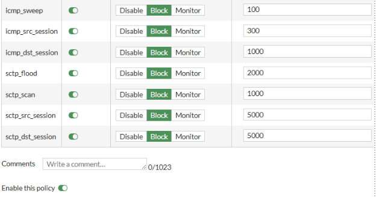

UDP Flood Attack:

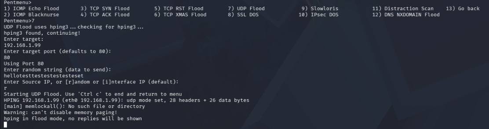
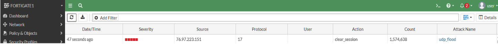

UDP Flood Attack successfully logged:

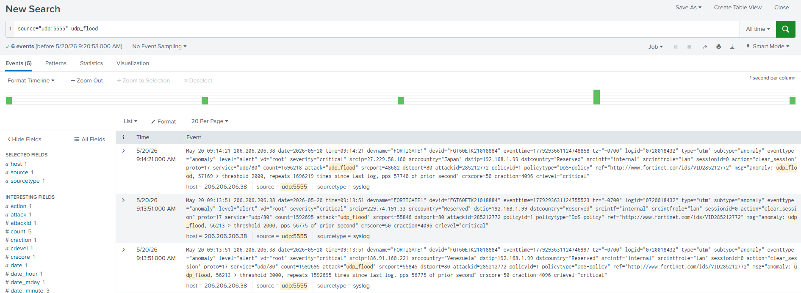

#

ICMP Echo Flood Attack:

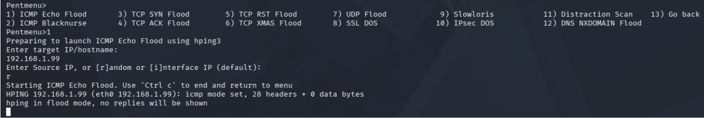
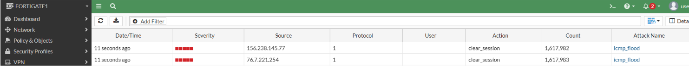

ICMP Echo Flood Attack successfully logged:

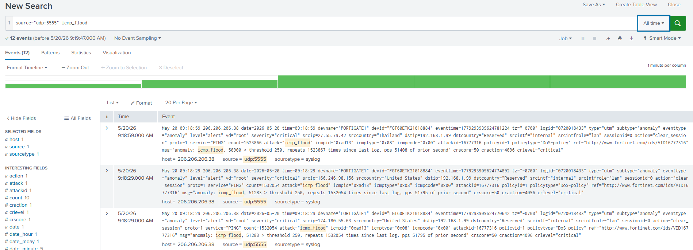

#

NMAP Scan Attack:

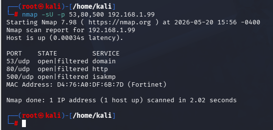

NMAP Scan Attack successfully logged:

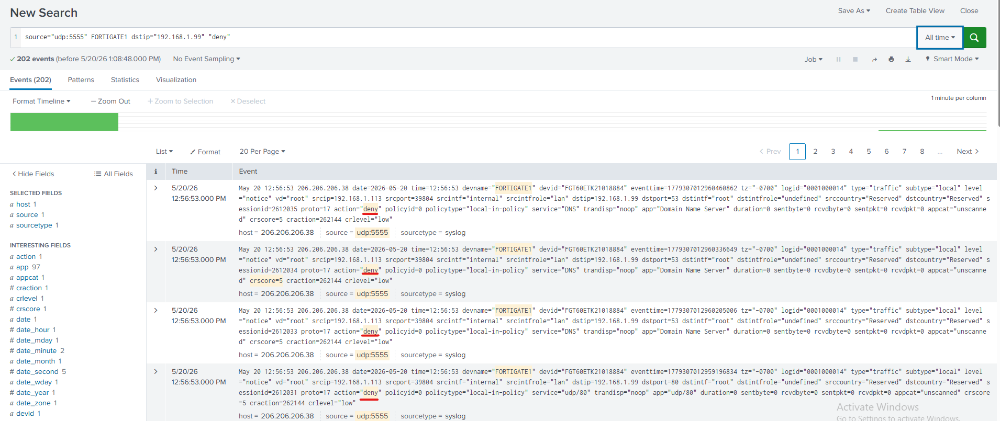

---

## All Firewall and Server logs collected in Splunk

FortiGate1: 

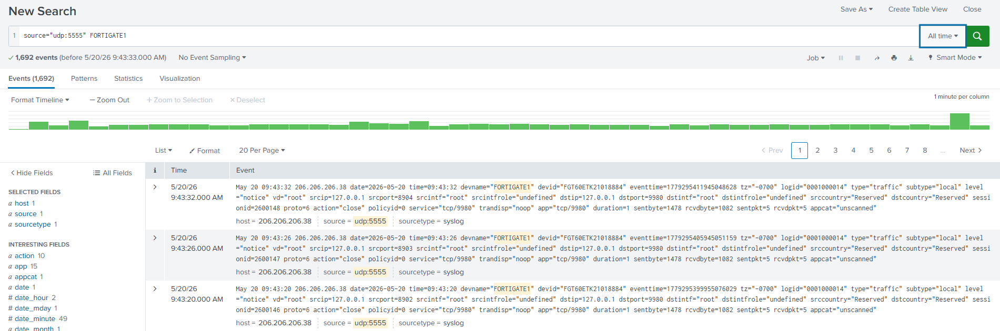

#

FortiGate2:

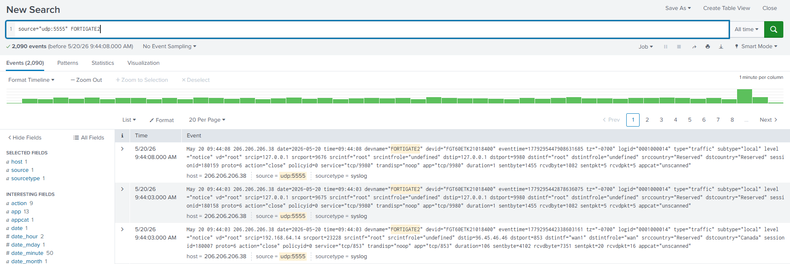

#

Apache Web Server:

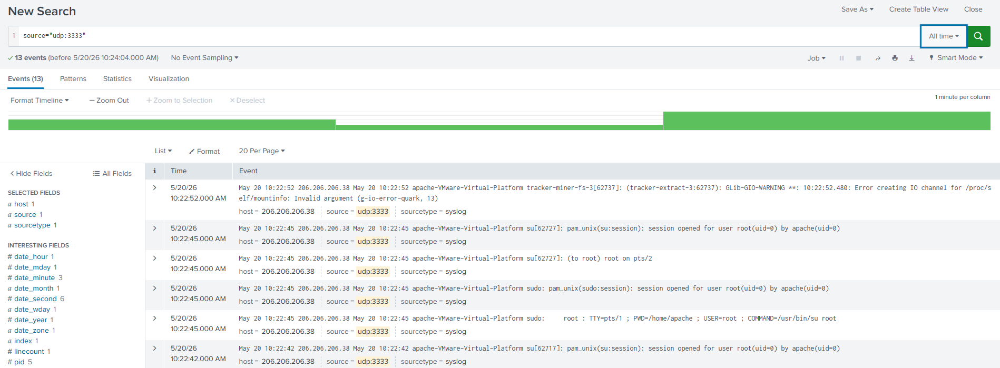

#

SSH Server:

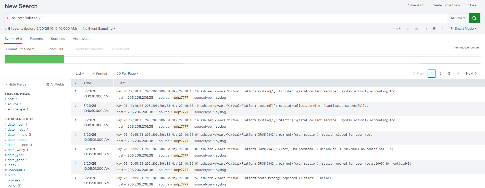

---

## AWS Integration

When setting up a VPN connection to AWS, two tunnels are automatically provisioned by AWS to maximize availability and eliminate single points of failure. With this in mind, it is best practice to take advantage of this design and configure both separate tunnels on the FortiGate firewall. Although, it is possible to bring up only a single tunnel and still maintain connectivity between both environments, we chose to utilize the dual-tunnel capability to ensure high availability and network resiliency in our enterprise environment

---

Tunnel 1:

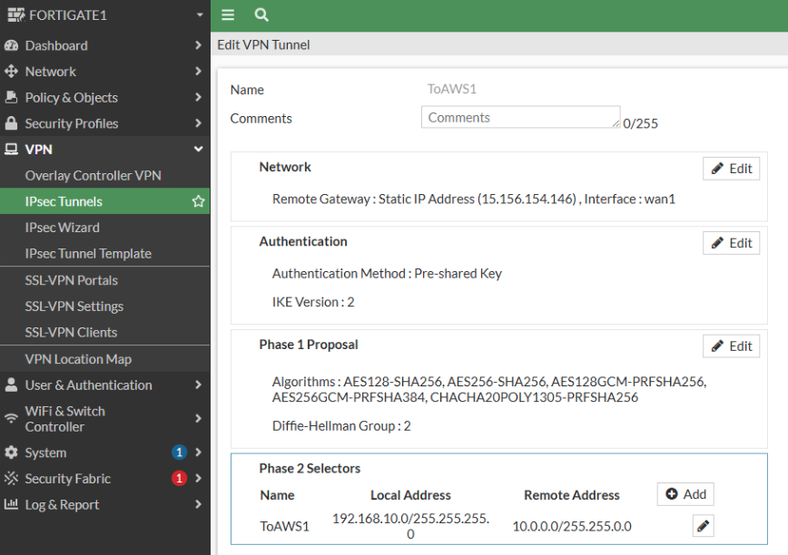

Tunnel 2:

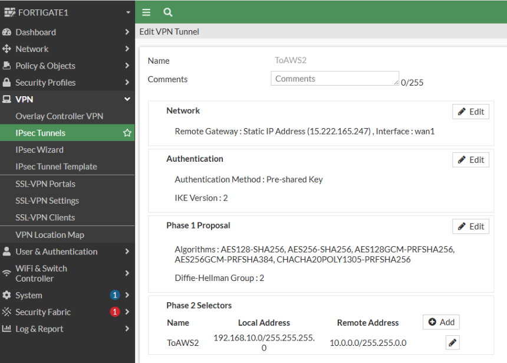

Dual tunnel interfaces active under WAN1:
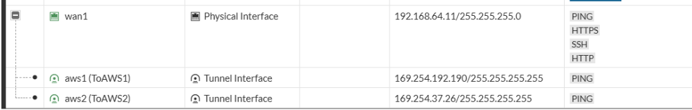

Static Routes set for each tunnel:
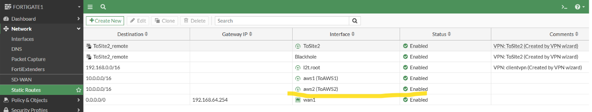

Firewall Policies in place:
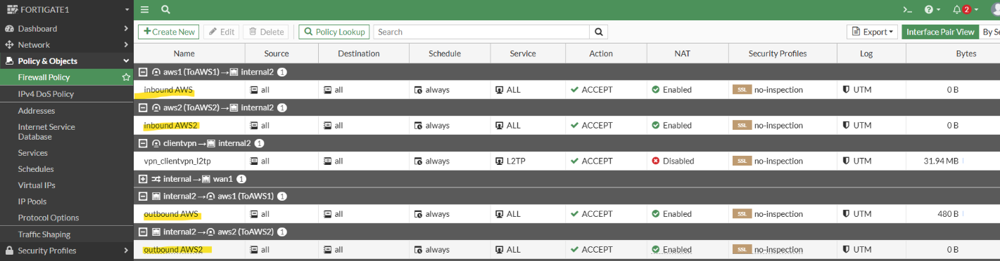

Both tunnels are successfully established and actively running:
[AWS_tunnel_connections](Images/AWS_tunnel_connections.png)
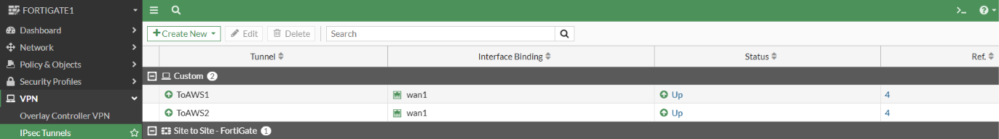

The AWS console verifies that both VPN connection tunnels are successfully established and functioning as required:
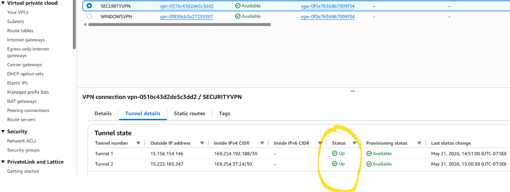

---

## Dashboard Creation

## FortiGate1 Sanitized configuration file

## FortiGate2 Sanitized configuration file

