# Enterprise Network Project - Security

## Project Overview 
A secure multi-site network infrastructure built using two FortiGate firewalls, site-to-site VPN connections, Client-Based VPN connection, and an AWS Cloud Tunnel integration. This setup forwards all network, server, and VPN logs into a centralized Splunk SIEM platform, providing full visibility and successful detection of active cyber attacks simulated through a Kali Linux attacker VM.

---

## Diagram
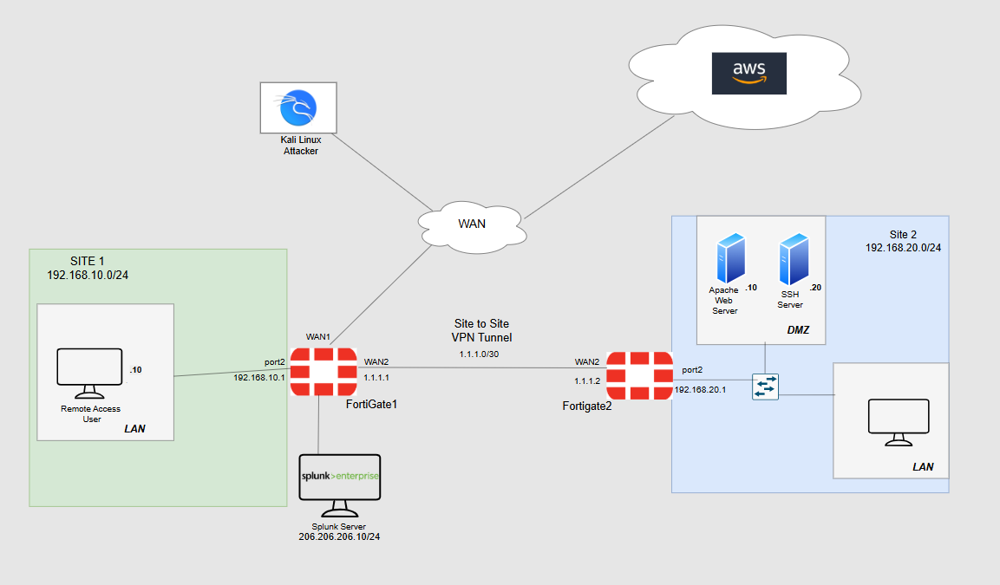

---

## Addressing Scheme
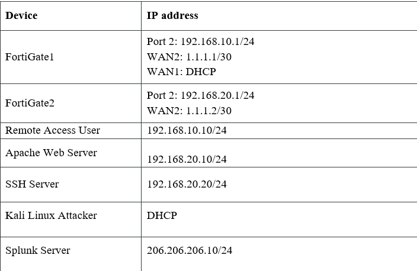

---

## Site-to-site VPN Implementation

Site 1 to Site 2:

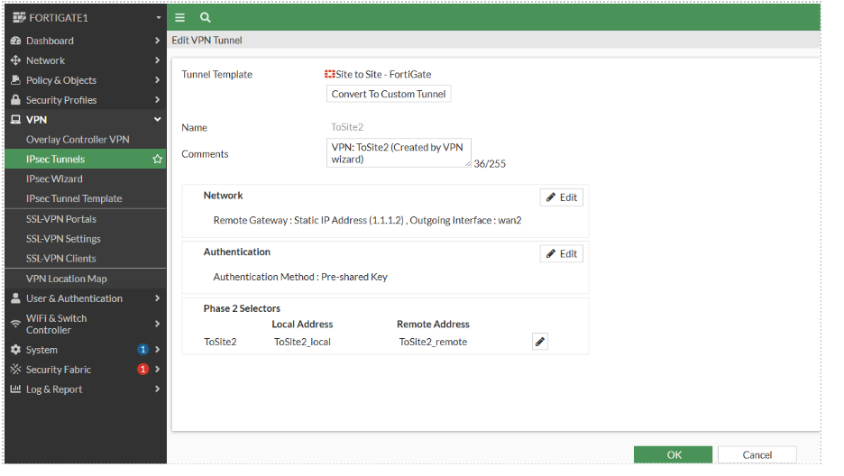
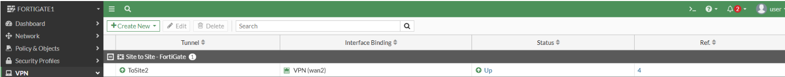

#

Site 2 to Site 1:

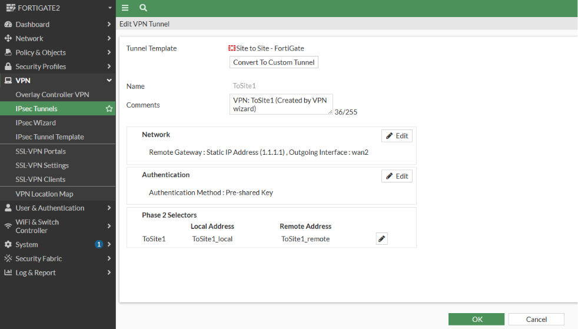
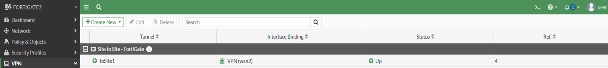

---

## Client-Based VPN for remote access

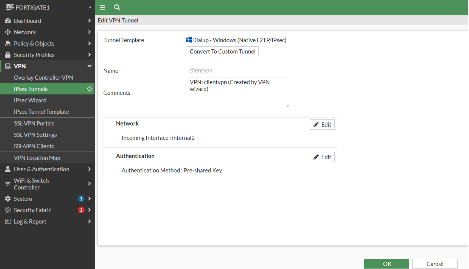

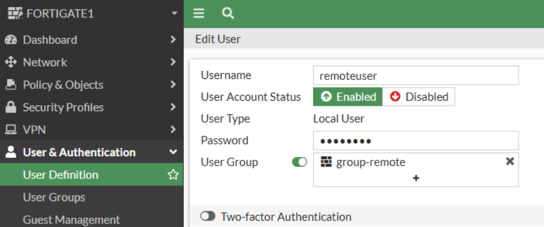

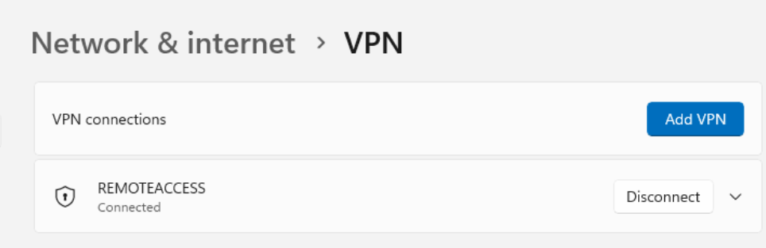

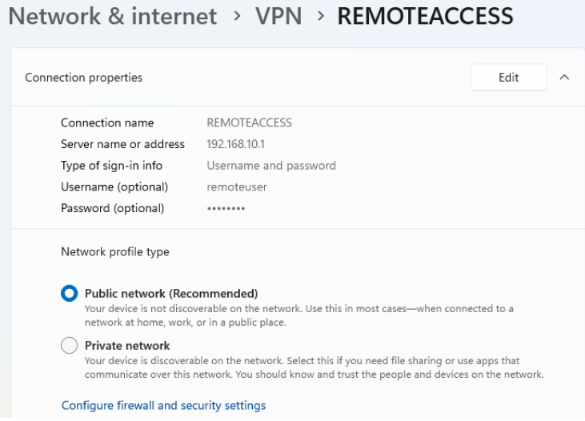

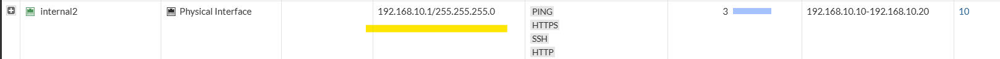

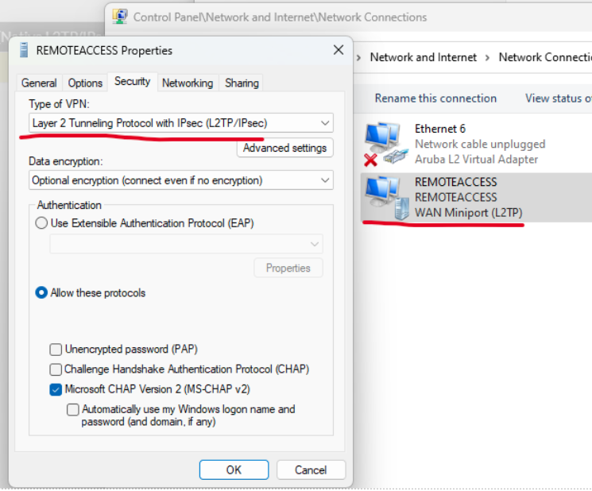

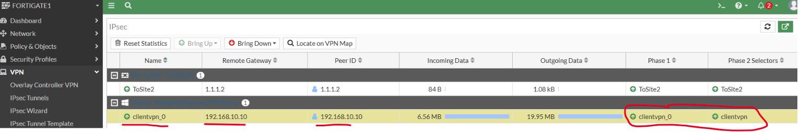

---

## Apache Web Server and SSH Server set up for remote accessible connections

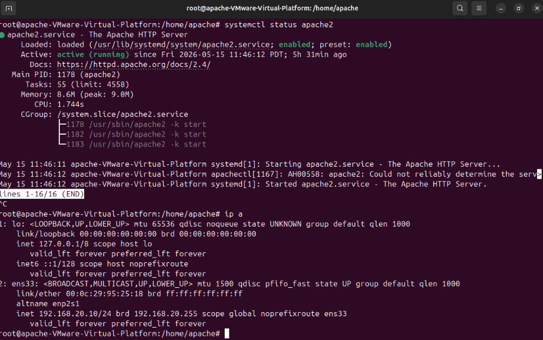
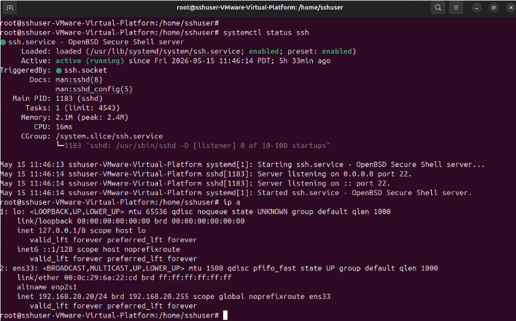

---

## Connectivity through VPN tunnel to servers from remote user established

Ping test:

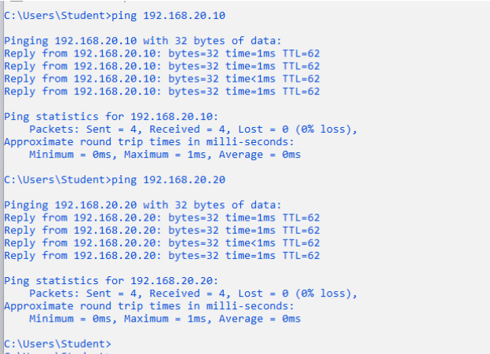

#

Apache Web Server connection test:

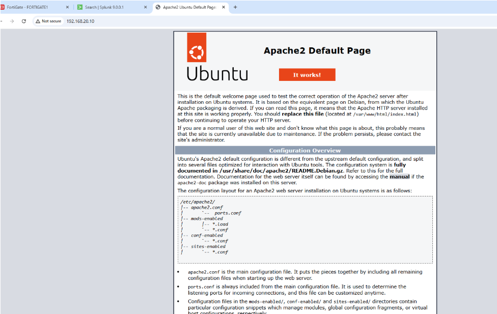

#

SSH Server connection test:

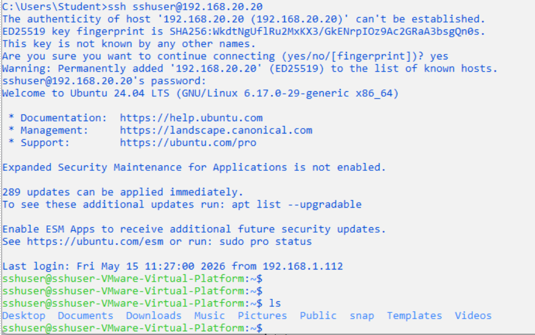

---

### Logging and Splunk setup to collect logs from required core devices

FortiGate1:

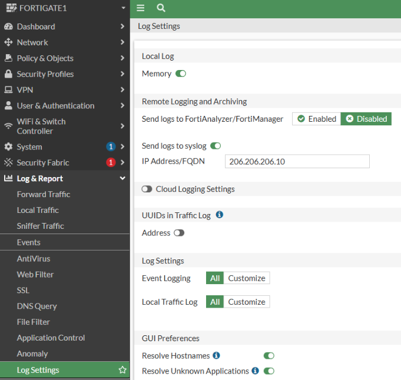
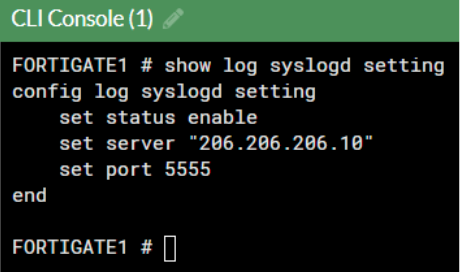

#

FortiGate2:

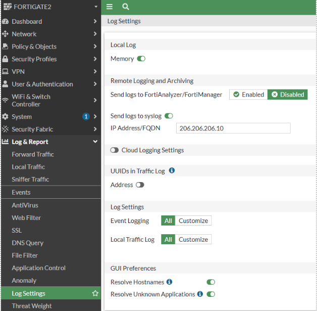
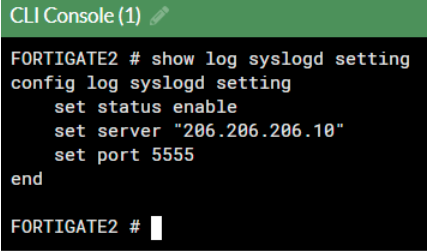

#

Apache Web Server:

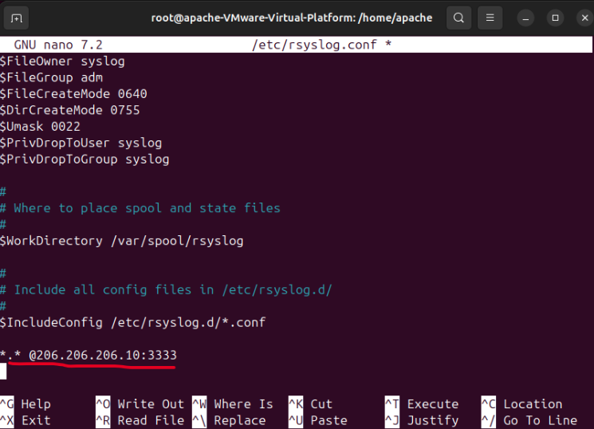

#

SSH Server:

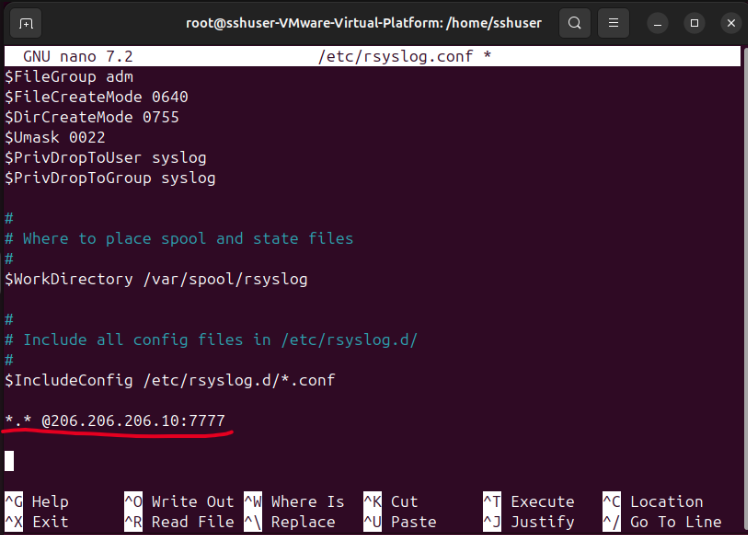

---

