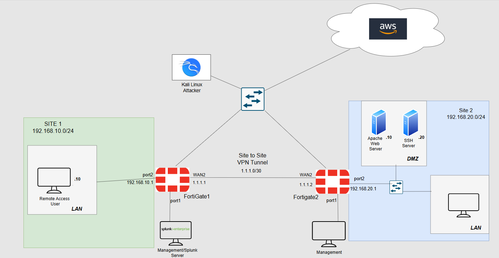
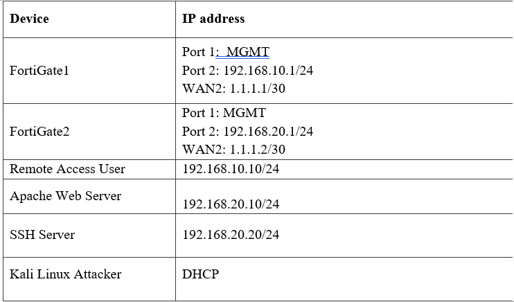
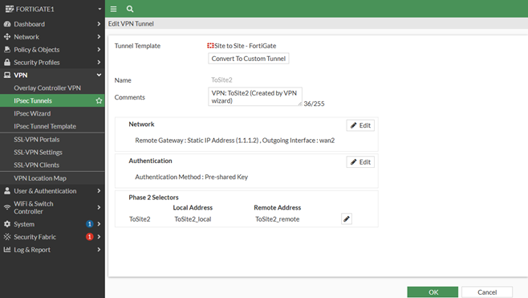

# Enterprise Network Project - Security

## Project Overview 
A secure multi-site network infrastructure built using two FortiGate firewalls, site-to-site VPN connections, Client-Based VPN connection, and an AWS Cloud Tunnel integration. This setup forwards all network, server, and VPN logs into a centralized Splunk SIEM platform, providing full visibility and successful detection of active cyber attacks simulated through a Kali Linux attacker VM.

---

## Diagram

---

## Addressing Scheme

---

## Site-to-site VPN Implementation

